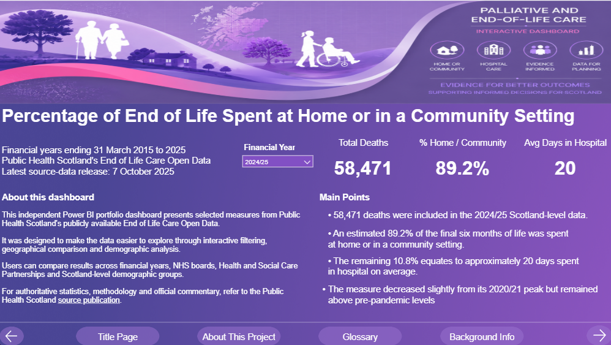

# Interactive End-of-Life Care Analysis — Power BI

The dashboard enables users to move from a Scotland-level overview into historical, geographical, Health and Social Care Partnership, and demographic analysis within one consistent reporting environment.

The project demonstrates an end-to-end BI workflow including data preparation, spatial processing, semantic modelling, DAX development, interactive reporting, data validation and stakeholder-focused dashboard design.

---

## Video Demonstration

### Employer-Facing Dashboard Walkthrough

▶️ **[Watch the main Power BI demonstration](https://youtu.be/kZi32zx_0-Y)**

This walkthrough focuses on the finished analytical solution, the interaction patterns, stakeholder value, and selected technical implementation.

---

## The Problem

End-of-life care statistics are publicly available in Scotland, but they're presented primarily through static reports and data tables. This creates friction for analysts and planners who need to:

- Compare historical patterns across financial years
- Investigate differences between geographical areas  
- Move from national to local reporting without separate reports
- Explore demographic patterns
- Answer follow-up questions themselves rather than requesting additional analysis

The objective of this project was to create a reusable, interactive analytical solution that enables stakeholders to investigate these questions independently.

---

## The Solution

The dashboard provides a structured analytical journey:

**1. Summary** — Headline national position with dynamic commentary and KPIs that update with financial year selection.

**2. Trend Analysis** — Historical comparison across 10 years, with the ability to compare Scotland-level trends against individual NHS Boards without duplicating reports.

**3. Geographical Analysis** — NHS Board variation visualised through an interactive Azure Maps layer, with supporting metrics and Scotland-level benchmarking.

**4. HSCP Local Analysis** — Health and Social Care Partnership level reporting, allowing granular local exploration while maintaining consistent calculation logic across all geographical levels.

**5. Demographic Analysis** — Flexible Scotland-level demographic exploration with selectable measures (deprivation, urban-rural, age & sex) and financial year ranges using Power BI field parameters.

Reusable DAX measures and a shared semantic model ensure the same reporting logic operates consistently across all these different analytical views.

---

## Key Finding

For 2024/25, Scottish data shows approximately **89.2% of the final six months of life** spent at home or in a community setting, with approximately **20 days** spent in hospital on average.

The report is designed to support exploration and investigation rather than imply causation from visual patterns alone.

---

## Technology & Workflow

| Component | Technology |
|---|---|
| **Source Data** | Public Health Scotland open data (aggregate) |
| **Spatial Processing** | R (NHS Board boundary preparation, GeoJSON generation) |
| **Data Transformation** | Power Query (ingestion, standardisation, validation) |
| **Data Model** | Power BI semantic model with defined relationships and lookup dimensions |
| **Calculations** | DAX (reusable measures, KPIs, dynamic narrative text) |
| **Interactive Visualisation** | Power BI (Azure Maps, field parameters, drill-down interactions) |
| **Quality Assurance** | Validation checks integrated into Power Query (filter propagation testing, relationship verification, calculated output checking) |

---

## Design Approach

The dashboard was built around a progressive analytical journey:

**Headline position → Historical trend → Geographic variation → Local variation → Demographic analysis**

Key design priorities included:

- **Visual hierarchy** — Most important information first
- **Consistent navigation** — Users understand the structure across all pages
- **Reduced cognitive load** — Clear language, minimal unnecessary elements
- **Self-service analysis** — Users can explore without producing static reports
- **Reusable reporting logic** — Calculations defined once, used everywhere
- **Transparency** — Methodology and limitations documented in the dashboard itself

---

## Technical Implementation

### Semantic Modelling

The report uses defined relationships between analytical tables and supporting lookup information (financial year, geographical dimensions). This allows filters to propagate consistently and enables calculation logic to be reused throughout the report without duplication.

### DAX & Reusable Measures

Reusable DAX measures drive:

- Aggregated totals and percentages
- Estimated days in hospital and at home
- Dynamic KPI card values
- Dynamic narrative text that updates alongside numerical results

This centralises calculation logic rather than duplicating calculations across individual visuals.

### Spatial Processing

R was used upstream to:

- Prepare NHS Board boundary data
- Generate the GeoJSON spatial layer used by the Azure Maps visualisation

This technical work provides the geographical boundary layer required for the interactive NHS Board analysis.

### Supporting R Scripts

Selected public-safe R scripts are included to provide technical evidence of the upstream analytical workflow:

- [`EoL_Open_Data.R`](scripts/EoL_Open_Data.R) — processes the publicly available End-of-Life Care open data used within the analytical workflow.
- [`geoJSON.R`](scripts/geoJSON.R) — processes NHS Board geographical boundaries and generates the GeoJSON layer used by the Power BI mapping solution.

These scripts are supporting portfolio examples rather than a complete production environment.

### Field Parameters

Power BI field parameters enable the demographic explorer to switch between different analytical dimensions (deprivation, urban-rural, age & sex) within the same visual. This provides a more flexible user experience while reducing duplicated report development.

### Data Quality & Validation

Quality assurance formed part of the development process rather than being treated as a final visual check. Validation included:

- Checking calculated outputs against source information
- Testing filters and slicers across multiple selections
- Checking relationships and filter behaviour across the model
- Validating dynamic KPI and narrative updates  
- Testing navigation and report interactions
- Documenting methodology and limitations

---

## Skills Demonstrated

**Business Intelligence**
- Power BI report development
- Self-service analytics and user empowerment
- Stakeholder-focused reporting
- Dashboard information hierarchy and UX

**Technical**
- Power Query and data transformation
- DAX and semantic modelling
- Table relationships and filter context
- Field parameters for flexible analysis
- R and spatial data processing
- GeoJSON and Azure Maps integration

**Analytical & Professional**
- Data validation and quality assurance
- Governance and responsible reporting
- Analytical interpretation and contextualization
- Stakeholder communication
- Iterative development and refinement

---

## Data Source & Disclaimer

This is an independent portfolio project using publicly available Scottish health data.

**Source:** Public Health Scotland End of Life Care Open Data

It is not an official publication and is not endorsed by the original data provider.

For authoritative statistics, methodology and official commentary, refer to the original published source:  
[Public Health Scotland End of Life Care Statistics](https://www.publichealthscotland.scot/)

---

## About This Project

This portfolio demonstrates how I approach Business Intelligence work: starting with the reporting problem and the people who need to use the information, then thinking about the data preparation, modelling, calculations and user experience required to turn that into something genuinely useful.

While this uses Scottish end-of-life care data, the methodology translates directly to Australian health systems, financial services, or any sector where stakeholders need interactive, trustworthy reporting.

I'm now looking to bring this approach into Australian organisations as a Power BI or Business Intelligence professional.
